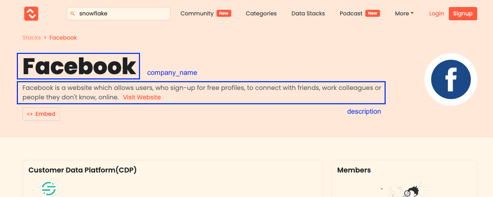

# Sample Project: Auto Tagging with MDS

In this project, we're going to build REST API with the data in [Modern Data Stack - Everything that you need to know ! | Modern Data Stack](https://www.moderndatastack.xyz/) so that clients manage modern data stack (MDS) services with user defined tag and rules.

[Categories](https://www.moderndatastack.xyz/categories) is a list of categories that are the key pillars to today’s Modern Data Stack. One primary data in this project is `Service` which contains description and metadata about the service such as [Snowflake](https://www.moderndatastack.xyz/company/snowflake) page.

[Data Stack](https://www.moderndatastack.xyz/stacks) is about how some of the companies in the world are organizing their data stack. The other primary data is `Company` which lists couple of services as their data stack such as [Facebook](https://www.moderndatastack.xyz/stacks/facebook) page.

## Requirements

- Design the architecture and the data model for REST APIs with data dependencies and system availability in mind
    - Choose infrastructure, database, programming language, and any libraries the way you want
- Build REST APIs to accomplish user stories listed below
    - Satisfy use cases provided as `ex)`, but build APIs that can be used universally

## User story

### Level 1 (Must)

- User wants to manage primary data via REST APIs
    - User wants to CRUD `Service`
    - User wants to CRUD `Company`

### Level 2 (Must)

- User wants to implement metadata management for primary data via REST APIs
    - User wants to CRUD tags
    - User wants to CRUD rules
- User wants to manually attach a key-value tag to `Service` for categorization
    - ex) Key: `Keyword`, Value: `Workspace`, `SQL`, `Management`
    - ex) Key: `Region`, Value: `North America`, `Asia`, `Europe`
    - ex) Key: `Popularity`, Value: `High`, `Medium`, `Low`
    - ex) Key: `Approach`, Value: `High-touch`, `Mid-touch`, `Low-touch`, `Tech-touch`
- User wants to automatically attach a tag to `Service` with metadata of the `Service` and user defined rules
    - ex) Attach `Keyword - Workspace` tag to services if description contains the word "workspace"
    - ex) Attach `Region - North America` tag to services if location is US or Canada
    - ex) Attach `Popularity - High` tag to services if number of likes is over 10
    - Tags MDS services on are supposed to be changed when the metadata of MDS services changed

### Level 3 (Optional)

- User wants to automatically attach a tag to `Service` with more complex conditions
    - ex) Attach `Popularity - High` tag to services if number of company which uses the service is over 10
    - ex) Attach `Approach - High-touch` tag to services if target segment contains "Enterprise" and pricing is "Contact Sales"
- User wants to add a new service to their data stacks because they started to use it
    - ex) Add a new service `Quollio` to the data stacks of `Facebook`
å
## Data Model

There are 4 fundamental data models; `Service`, `Tag`, `Rule`, and `Company`. Please add other fields or create a new data model if needed.

### Service

`Service` is a data tool to compose MDS. The fundamental data of `Service` is listed in the table below;

| #   | Field          |
| --- | -------------- |
| 1   | service_name   |
| 2   | description    |
| 3   | more_about     |
| 4   | category       |
| 5   | like           |
| 6   | category       |
| 7   | stage          |
| 8   | target_segment |
| 9   | deployment     |
| 10  | business_model |
| 11  | pricing        |
| 12  | location       |
| ?   | ???????        |

### Company

`Company` is a user company which uses several `Service` as MDS. `Company` has one-to-many relations to `Service`.

| #   | Field        |
| --- | ------------ |
| 1   | company_name |
| 2   | description  |
| ?   | ???????      |

### Tag

`Tag` is a key-value label for categorization of `Service`. Users want to define a tag by themselves and attach it to `Service`.

| #   | Field   |
| --- | ------- |
| ?   | ??????? |

### Rule

`Rule` is defined by users to automatically attach `Tag` to `Service`. By creating `Rule`, user can systematically categorize `Service` with metadata in `Service` under certain conditions.

| #   | Field   |
| --- | ------- |
| ?   | ??????? |
